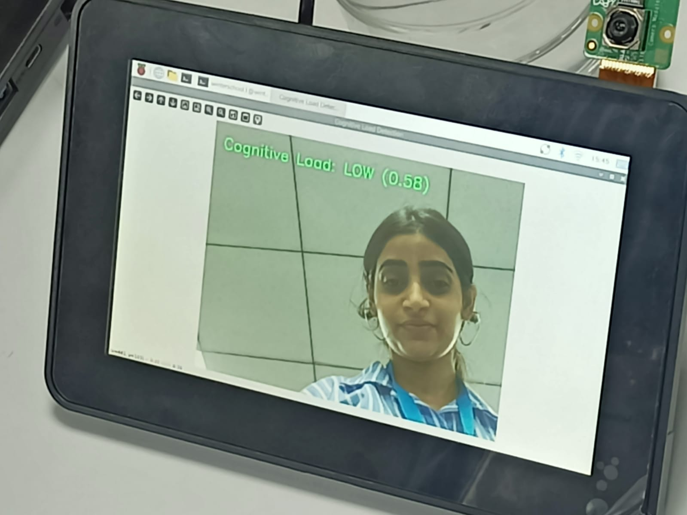

# Cognitive Load Detection

This project implements a real-time cognitive load detection system using facial feature analysis. It leverages MediaPipe for facial landmark detection and a machine learning model to classify cognitive load levels (LOW, MEDIUM, HIGH) based on eye aspect ratio, blink frequency, and facial motion energy.

The system includes both a pre-trained model for real-time inference and a training pipeline using the DAiSEE dataset.

## Features

- Real-time cognitive load detection from webcam feed
- Facial feature extraction using MediaPipe
- Machine learning classification with RandomForest
- Training pipeline for model customization

## Installation

1. Clone the repository:
   ```
   git clone https://github.com/ashankgupta/cognitive_load_detection.git
   cd project
   ```

2. Create and activate a virtual environment:

   **Windows:**
   ```
   python -m venv venv
   venv\Scripts\activate
   ```

   **macOS/Linux:**
   ```
   python3 -m venv venv
   source venv/bin/activate
   ```

3. Install dependencies:
   ```
   pip install -r requirements.txt
   ```

4. Ensure you have the necessary system libraries for OpenCV and GStreamer (for camera access on Linux).

## Usage

### Running the Real-Time Detection

The `main.py` script performs real-time cognitive load detection using your webcam.

1. Ensure the pre-trained model `cognitive_load_model.pkl` is present in the project directory.

2. Run the script:
   ```
   python main.py
   ```

3. The application will open a window displaying the camera feed with real-time cognitive load predictions. Press 'Esc' to exit.

**Note**: This script uses libcamera for Raspberry Pi or similar devices. For standard webcams, modify the pipeline in `main.py` accordingly.

### Training the Model

The `main.ipynb` Jupyter notebook contains the training pipeline.

1. Download the DAiSEE dataset from Kaggle and place it in the `kaggle/input/daisee/DAiSEE/DataSet/Train/` directory as expected by the notebook.

2. Open the notebook:
   ```
   jupyter notebook main.ipynb
   ```

3. Run the cells in order:
   - Load and preprocess labels
   - Extract features from video clips
   - Train the RandomForest model with grid search
   - Evaluate and save the model as `cognitive_load_model.pkl`

The notebook includes data balancing, feature extraction, hyperparameter tuning, and model evaluation.

## Problem Statement

Cognitive load refers to the amount of mental effort required to process information. High cognitive load can lead to decreased performance, stress, and errors in tasks such as learning or work. Detecting cognitive load in real-time from facial expressions can help in adaptive systems, education, and human-computer interaction.

## Goal of the Project

The goal is to develop a non-invasive, real-time system that analyzes facial features from webcam video to classify cognitive load into three levels: LOW, MEDIUM, and HIGH. This enables applications like personalized learning environments, workload monitoring, and user experience optimization.

## Dataset

The training uses the DAiSEE dataset, which contains video clips of students with annotated engagement, boredom, confusion, and frustration levels. Cognitive load is derived from these labels:

- LOW: Boredom < 2
- MEDIUM: Boredom >= 2
- HIGH: Confusion >= 2 or Frustration >= 2

Download the dataset from [Kaggle DAiSEE](https://www.kaggle.com/datasets/olgaparfenova/daisee) or the official source.

## Dependencies

See `requirements.txt` for the full list. Key libraries include:

- OpenCV
- MediaPipe
- scikit-learn
- pandas
- numpy
- tqdm

## Model Pipeline and Workflow

1. **Data Preparation**: Load DAiSEE dataset labels, filter available videos, balance classes (40% LOW, 30% MEDIUM, 30% HIGH).
2. **Feature Extraction**: For each video, use MediaPipe to detect facial landmarks, compute eye aspect ratio (EAR), blink count, and facial motion energy over frames.
3. **Model Training**: Train RandomForest classifier with grid search hyperparameter tuning (max_depth, max_leaf_nodes, min_samples_split, n_estimators).
4. **Evaluation**: Use stratified k-fold cross-validation with F1-weighted scoring.
5. **Inference**: In real-time, capture webcam frames, extract features over a window, predict cognitive load level.

## Model Details

- **Features**: Eye aspect ratio (EAR), blink count, facial motion energy
- **Classifier**: RandomForest with optimized hyperparameters (max_depth=10, max_leaf_nodes=5, min_samples_split=5, n_estimators=200)
- **Performance**: F1-weighted score ~0.40 on cross-validation

## Deployment Details

The system is deployed as a Python script (main.py) for real-time inference on local machines. It requires a webcam and runs on CPU/GPU with OpenCV and MediaPipe. For production, it can be containerized with Docker or integrated into web apps using Flask/Django. Ensure camera permissions and compatible hardware (tested on Linux with libcamera for Raspberry Pi).

## Troubleshooting

- **Camera Issues**: Ensure camera permissions and correct pipeline for your device.
- **Model Not Found**: Verify `cognitive_load_model.pkl` exists.
- **Video Processing**: Requires sufficient RAM for large video files.

## Team Members

- Ashank Gupta,Vatsal,Gurleen Kaur,Sakshi Jadhav,Tanvi Thakre

## Contributing

Contributions are welcome. Please ensure code follows the existing style and includes tests where applicable.
